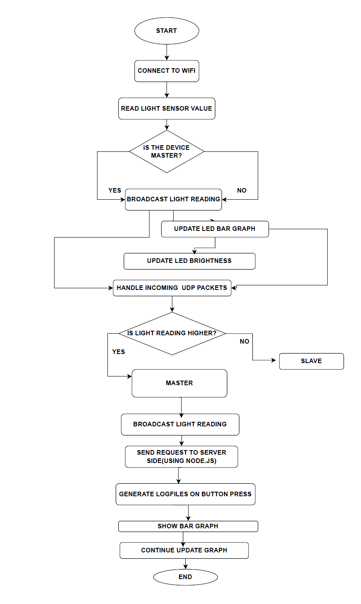

# Wireless Light Sensor Swarm (ESP8266 + Raspberry Pi + MAX7219)

This project creates a distributed light-sensing system using multiple ESP8266 modules and a Raspberry Pi. The system determines a "Master" node based on the highest light reading and visualizes this data on an LED matrix and a web dashboard.

---

## 📡 System Overview

- **ESP8266** reads light intensity and broadcasts it via UDP.
- **Raspberry Pi** listens for packets, identifies the master device, and updates:
  - An 8×8 LED Matrix (MAX7219)
  - Dedicated GPIO LEDs for active devices
  - Web dashboard using Socket.IO

---

## 🧱 Components

### 🔌 Hardware
- ESP8266 (e.g., NodeMCU) with photocell sensor
- Raspberry Pi (any version with GPIO + SPI)
- MAX7219 8x8 LED Matrix
- 3x GPIO LEDs
- Tactile Button

### 📦 Software
- Python 3 (for Raspberry Pi server)
- Node.js (for dashboard, optional)
- Arduino sketch for ESP8266

---

## 🔁 Data Flow

1. ESP8266 reads photocell value and broadcasts via UDP
2. Raspberry Pi listens for packets and:
   - Identifies Master (highest light reading)
   - Logs time per Master
   - Displays reading on LED matrix
   - Notifies Node.js dashboard
3. Button press triggers a global reset via UDP broadcast

---

## 📊 System Flowchart

